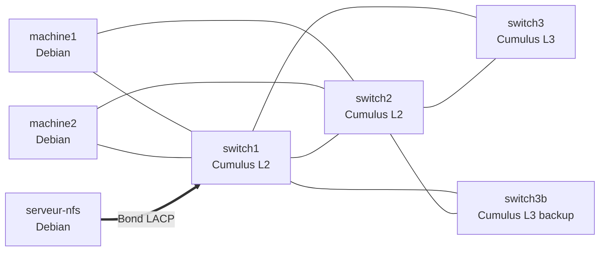
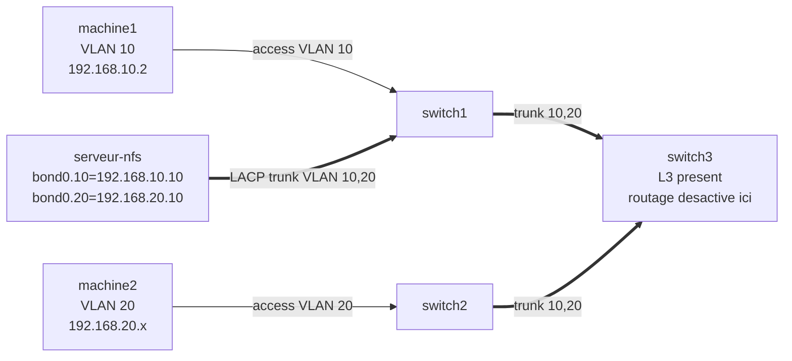
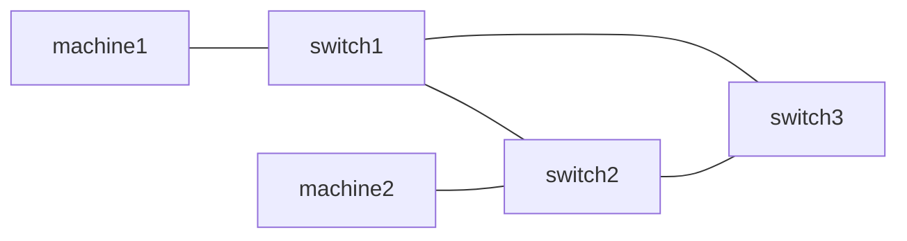

# Rapport de Projet M1 Administration Reseau

## ADMINSYSRES2 - Infrastructure HA automatisee avec Ansible

Nom et prenom : Derardja Abderraouf  
Numero etudiant : 20255067  
Nom et prenom : Bouaya Ayoub  
Numero etudiant : 20254976  
Annee universitaire : 2025-2026  
Date : 02/04/2026

---

## Resume

Ce rapport presente un projet M1 Administration Reseau base sur l'automatisation Ansible d'une infrastructure de labo VMware. L'objectif est de deployer une architecture tolerante aux pannes a plusieurs niveaux :

- partage NFS segmente par VLAN (partie 1) ;
- prevention des boucles et redondance L2 STP/RSTP (partie 2) ;
- tolerance de panne d'acces via LACP/MLAG (partie 3) ;
- redondance de passerelle via VRRP (partie 4).

Le depot Git sert de fil conducteur de la demarche technique et de gestion de projet. Les playbooks sont structures pour produire une execution reproductible, testable et restaurable.

---

## 1. Contexte et objectifs du projet

### 1.1 Contexte pedagogique

En M1 Administration Reseau, le projet vise a relier 3 dimensions :

- architecture reseau (choix de protocoles et topologie) ;
- automatisation (Ansible, roles, variables, inventaire) ;
- exploitation (tests, validation, restauration).

### 1.2 Problematique

Comment construire une infrastructure reseau qui reste operationnelle lors de pannes de liens ou d'equipements, tout en limitant les erreurs de configuration manuelle ?

### 1.3 Objectifs

- automatiser toutes les configurations avec Ansible ;
- isoler les flux machine1/machine2 via VLAN ;
- fournir un stockage NFS accessible de facon controlee ;
- assurer la resilience L2 (STP puis RSTP) ;
- assurer la resilience d'acces (LACP/MLAG) ;
- assurer la resilience de passerelle (VRRP) ;
- conserver un mode restauration rapide via backup/restore.

---

## 2. Description du depot et environnement

### 2.1 Environnement technique

- Hyperviseur : VMware
- Equipements reseau : Cumulus Linux (`switch1`, `switch2`, `switch3`, `switch3b`)
- Hotes Linux : `serveur-nfs`, `machine1`, `machine2`
- Outil d'automatisation : Ansible (SSH, sans agent)
- Versionnement : Git (branche principale `main`)

### 2.2 Fichiers cles du projet

- `01-nfs-partage.yml` : NFS + VLAN + bonding serveur
- `02-stp-redondance.yml` : etude STP classique + mesures
- `02-rstp-redondance.yml` : bascule RSTP
- `03-tolerance-access.yml` : LACP/MLAG cote acces
- `04-redondance-routeur.yml` : VRRP sur routeurs L3
- `98-configbase.yml` : creation de baseline backup
- `99-restore.yml` : restauration + nettoyage etat
- `group_vars/all.yml` + `host_vars/*.yml` : variables de topologie
- `roles/*` : logique technique reutilisable

### 2.3 Topologie globale (vue d'ensemble)



### 2.4 Captures a inserer (global)

| ID capture | Type de capture          | Ce qui doit apparaitre                      |
| ---------- | ------------------------ | ------------------------------------------- |
| G-01       | Capture ecran VMware     | Vue des VMs allumees et nommage coherent    |
| G-02       | Capture terminal Ansible | `ansible all -m ping` avec hotes joignables |
| G-03       | Capture Git log          | Historique des commits du projet            |

---

## 3. Methode de gestion de projet appliquee

Le rapport suit les etapes vues en cours de gestion de projet. Pour chaque playbook, on retrouve le meme cycle :

1. Cadrage : besoin, objectifs, contraintes, criteres de succes.
2. Planification : prerequis, ordonnancement, risques.
3. Execution : deploiement technique automatise.
4. Suivi et controle : mesures, tests, preuves.
5. Cloture et capitalisation : resultat final, limites, actions d'amelioration.

Cette approche permet de traiter chaque partie comme un mini-projet tout en conservant la coherence du projet global.

---

## 4. Partie 1 - NFS, VLAN et bonding serveur

Playbook principal : `01-nfs-partage.yml`

### 4.1 Topologie de la partie 1



### 4.2 Cadrage (gestion de projet)

- Besoin : centraliser les donnees via NFS tout en isolant `machine1` et `machine2`.
- Contraintes : pas de routage/firewall cote clients, isolation VLAN stricte.
- Criteres de succes : montage NFS fonctionnel par machine, ping croise inter-clients bloque.

### 4.3 Planification

- Pre-requis :
  - paquets `ifenslave`, `vlan`, `nfs-kernel-server`, `nfs-common` ;
  - variables VLAN/IPS dans `group_vars/all.yml` ;
  - ports physiques definis dans `host_vars/switch*.yml`.
- Ordre d'execution prevu :
  1. packages ;
  2. VLAN switches ;
  3. desactivation inter-VLAN temporaire ;
  4. bond LACP serveur ;
  5. exports NFS ;
  6. interfaces clients ;
  7. montage NFS.

### 4.4 Execution technique

- Role `vlans` : ports access/trunk sur `switch1`, `switch2`, trunks vers `switch3`.
- Role `bonding-server` : creation `bond0` + `bond0.10` + `bond0.20` sur `serveur-nfs`.
- Role `nfs-server` : creation des repertoires `/machine1` et `/machine2`, deployment `/etc/exports`.
- Role `nfs-client` : test de connectivite et montage NFS cible par machine.

### 4.5 Suivi et controle

Controles proposes :

- `cat /proc/net/bonding/bond0` sur `serveur-nfs` ;
- `exportfs -v` sur `serveur-nfs` ;
- `df -hT /machine1` puis `df -hT /machine2` sur les clients ;
- `ping machine1 -> machine2` doit echouer (isolation VLAN).

### 4.6 Cloture et capitalisation

- Resultat attendu : NFS operationnel et segmentation effective.
- Point de vigilance issu du projet : ne pas melanger mode `access` et `trunk` sur le meme bond serveur si le serveur utilise des VLAN tags (`bond0.10`, `bond0.20`).

### 4.7 Captures a inserer (partie 1)

| ID capture | Type de capture          | Ce qui doit apparaitre                                              |
| ---------- | ------------------------ | ------------------------------------------------------------------- |
| P1-01      | Capture terminal Linux   | `ip -br a` sur `serveur-nfs` avec `bond0.10` et `bond0.20`          |
| P1-02      | Capture terminal Cumulus | `net show configuration commands` sur `switch1` (bond + trunk VLAN) |
| P1-03      | Capture terminal Linux   | `exportfs -v`                                                       |
| P1-04      | Capture terminal Linux   | `df -hT /machine1` et `df -hT /machine2`                            |
| P1-05      | Capture test reseau      | ping inter-clients bloque                                           |
| P1-06      | Capture recap Ansible    | `PLAY RECAP` de `01-nfs-partage.yml`                                |

---

## 5. Partie 2 - Redondance L2 (STP puis RSTP)

Playbooks : `02-stp-redondance.yml` et `02-rstp-redondance.yml`

### 5.1 Topologie de la partie 2



### 5.2 Cadrage (gestion de projet)

- Besoin : eliminer les boucles L2 en topologie triangulaire.
- Criteres de succes :
  - presence d'un port bloque en STP ;
  - convergence mesurable ;
  - amelioration observable en RSTP.

### 5.3 Planification

- Sequence pedagogique planifiee :
  1. baseline sans STP ;
  2. observation impact boucle ;
  3. activation STP ;
  4. mesure convergence ;
  5. migration RSTP.
- Risques : tempete de broadcast, MAC flapping, surcharge CPU switches.

### 5.4 Execution technique

- `02-stp-redondance.yml` :
  - configure IP de test clients ;
  - force un etat sans STP ;
  - lance pings asynchrones ;
  - collecte CPU/paquets ;
  - reactive STP classique (`mstpctl ... stp`) ;
  - recupere la table STP et les ports bloques.
- `02-rstp-redondance.yml` :
  - force RSTP (`mstpctl setforcevers bridge rstp`) ;
  - verifie l'etat du bridge RSTP.

### 5.5 Suivi et controle

Indicateurs de qualite :

- pertes ping avant/apres ;
- temps de convergence calcule ;
- etats de ports (`blocking`/`discarding`) ;
- stabilite de la table MAC.

### 5.6 Cloture et capitalisation

- Conclusion technique : RSTP est la cible d'exploitation (convergence plus rapide), STP reste utile pour la demonstration comparative.
- Impact projet : meilleure disponibilite L2 sans modifier l'architecture physique.

### 5.7 Captures a inserer (partie 2)

| ID capture | Type de capture          | Ce qui doit apparaitre                                  |
| ---------- | ------------------------ | ------------------------------------------------------- |
| P2-01      | Capture terminal Cumulus | `cat /sys/class/net/bridge/bridge/stp_state` a 0 puis 1 |
| P2-02      | Capture terminal Linux   | resultat ping long sans STP (pertes)                    |
| P2-03      | Capture metrique systeme | CPU switches pendant boucle                             |
| P2-04      | Capture terminal Cumulus | `brctl showstp bridge` avec root/blocked                |
| P2-05      | Capture terminal Cumulus | `mstpctl showbridge bridge` en RSTP                     |
| P2-06      | Capture recap Ansible    | `PLAY RECAP` des playbooks STP/RSTP                     |

---

## 6. Parties 3 et 4 liees - Tolerance d'acces et redondance de passerelle

Playbooks : `03-tolerance-access.yml` + `04-redondance-routeur.yml`

Important : ces deux parties sont volontairement traitees ensemble. La partie 3 securise l'acces serveur/client (LACP/MLAG), puis la partie 4 stabilise la passerelle (VRRP). L'une renforce l'autre.

### 6.1 Topologie combinee (3 + 4)

```mermaid
flowchart TB
  M1[machine1\nbond0 (ens34+ens35)]
  M2[machine2\nbond0 (ens34+ens35)]

  S1[switch1\nMLAG peer A]
  S2[switch2\nMLAG peer B]

  S3[switch3\nVRRP MASTER]
  S3B[switch3b\nVRRP BACKUP]

  M1 == LACP ==> S1
  M1 == LACP ==> S2
  M2 == LACP ==> S1
  M2 == LACP ==> S2

  S1 <-- peer-link/CLAG --> S2

  S1 -- trunk VLAN10,20 --> S3
  S2 -- trunk VLAN10,20 --> S3
  S1 -- trunk VLAN10,20 --> S3B
  S2 -- trunk VLAN10,20 --> S3B

  VIP10[VIP VLAN10: 192.168.1.254]
  VIP20[VIP VLAN20: 192.168.2.254]

  S3 --- VIP10
  S3B --- VIP10
  S3 --- VIP20
  S3B --- VIP20
```

### 6.2 Cadrage (gestion de projet)

- Besoin metier : maintenir les flux lors de pannes de liens et de routeur.
- Criteres de succes :
  - trafic maintenu si un lien d'acces tombe ;
  - passerelle virtuelle joignable pendant la perte du routeur principal ;
  - reprise nominale apres remise en service.

### 6.3 Planification

Plan en deux temps, mais continu :

1. Partie 3 (acces resilients)
   - config bonding clients (`mlag-client`) ;
   - config CLAG/MLAG sur `switch1` et `switch2` ;
   - troncs VLAN vers `switch3`.
2. Partie 4 (passerelle resiliente)
   - VRRP MASTER sur `switch3` ;
   - VRRP BACKUP sur `switch3b` ;
   - verification du basculement.

Risques identifies :

- incoherence des `clag id` entre switchs peers ;
- mauvaise priorite VRRP ;
- conflit de plan IP entre phases (10.x/20.x vs 1.x/2.x selon fichiers).

### 6.4 Execution technique (partie 3)

- `03-tolerance-access.yml` :
  - deploie `bond0` sur clients via template `roles/mlag-client/templates/interfaces.j2` ;
  - configure bonds MLAG (`bond-m1`, `bond-m2`) et `clag id` ;
  - met en place peer-link et parametres CLAG ;
  - prepare les trunks VLAN 10/20 vers coeur.

### 6.5 Execution technique (partie 4)

- `04-redondance-routeur.yml` :
  - configure `switch3` en VRRP MASTER ;
  - configure `switch3b` en VRRP BACKUP ;
  - expose VIP passerelle (x.x.x.254) pour VLAN 10 et 20 ;
  - active `ip_forward` et redemarre FRR.

### 6.6 Suivi et controle

Tests cibles :

- `net show clag` sur `switch1` et `switch2` ;
- `cat /proc/net/bonding/bond0` sur `machine1` et `machine2` ;
- ping continu pendant coupure d'un lien d'acces ;
- ping continu pendant arret `switch3` (bascule vers `switch3b`).

### 6.7 Cloture et capitalisation

- Gain principal : suppression des SPOF d'acces et de passerelle.
- Livrable final : architecture haute disponibilite multi-couches (acces + L3).
- Point d'amelioration : normaliser les plans IP dans tous les fichiers pour eviter les ambiguities en exploitation.

### 6.8 Captures a inserer (parties 3 + 4)

| ID capture | Type de capture          | Ce qui doit apparaitre                       |
| ---------- | ------------------------ | -------------------------------------------- |
| P34-01     | Capture terminal Cumulus | `net show clag` sur `switch1`                |
| P34-02     | Capture terminal Cumulus | `net show clag` sur `switch2`                |
| P34-03     | Capture terminal Linux   | `/proc/net/bonding/bond0` sur `machine1`     |
| P34-04     | Capture terminal Linux   | `/proc/net/bonding/bond0` sur `machine2`     |
| P34-05     | Capture test reseau      | ping continu pendant coupure d'un lien acces |
| P34-06     | Capture terminal Cumulus | etat VRRP MASTER (`switch3`)                 |
| P34-07     | Capture terminal Cumulus | etat VRRP BACKUP (`switch3b`)                |
| P34-08     | Capture test reseau      | ping continu pendant bascule VRRP            |
| P34-09     | Capture recap Ansible    | `PLAY RECAP` playbooks 03 et 04              |

---

## 7. Playbooks de cycle de vie (baseline et restauration)

### 7.1 `98-configbase.yml`

- Role : prendre une sauvegarde baseline Cumulus (`config-backup -D "Baseline CLEAN" -p`).
- Utilite gestion de projet : point de retour stable avant experiences.

### 7.2 `99-restore.yml`

- Role : restaurer la baseline et nettoyer l'etat (NFS, interfaces, montages, services).
- Utilite gestion de projet : securiser les iteractions de tests et eviter les faux positifs.

### 7.3 Captures a inserer (cycle de vie)

| ID capture | Type de capture          | Ce qui doit apparaitre           |
| ---------- | ------------------------ | -------------------------------- |
| LC-01      | Capture terminal Cumulus | resultat `config-backup`         |
| LC-02      | Capture terminal Cumulus | resultat `config-restore`        |
| LC-03      | Capture recap Ansible    | `PLAY RECAP` de `99-restore.yml` |

---

## 8. Trajectoire Git et conduite du projet

L'historique Git du depot montre la progression technique par increments :

| Commit    | Message                                               | Lecture projet                        |
| --------- | ----------------------------------------------------- | ------------------------------------- |
| `68c9b20` | `nfs m-solution`                                      | Validation de la partie 1             |
| `975cc4e` | `stp initial`                                         | Premiere iteration partie 2           |
| `41d54db` | `fixing port varibale for stp`                        | Ajustement topologie/variables        |
| `014766a` | `Fixing stp permutation with rstp and mlag setup`     | Transition vers architecture complete |
| `18e82a9` | `fix mlag interface variables`                        | Stabilisation partie 3                |
| `d10d4aa` | `Reparing the third playbook and starting the fourth` | Liaison 3 -> 4                        |
| `3046550` | `playbook four working`                               | Premiere version VRRP operationnelle  |
| `58d05b0` | `Fix des playbooks 3 et 4`                            | Consolidation finale                  |

Interpretation etudiante : la demarche a ete iterative, avec des corrections guidees par les tests terrain (interfaces, ports, variables, convergences).

---

## 9. Verification finale (recette)

### 9.1 Tableau de validation

| Exigence                    | Test                                                | Resultat attendu          |
| --------------------------- | --------------------------------------------------- | ------------------------- |
| Isolation machine1/machine2 | Ping inter-clients en partie 1                      | Echec du ping             |
| Service NFS                 | Montage et ecriture dans `/machine1` et `/machine2` | OK                        |
| Protection boucle L2        | STP/RSTP actif sur triangle                         | Port bloque + convergence |
| Resilience acces            | Coupure d'un lien client/switch                     | Trafic maintenu           |
| Resilience passerelle       | Arret MASTER VRRP                                   | Bascule vers BACKUP       |
| Reproductibilite            | Reexecution playbooks apres restore                 | Meme comportement         |

### 9.2 Criteres de reussite academiques M1

- maitrise des protocoles reseau (STP/RSTP/LACP/VRRP) ;
- maitrise de l'automatisation Ansible ;
- capacite de test, diagnostic, et restauration ;
- tracabilite du travail via Git.

---

## 10. Limites, risques et ameliorations

### 10.1 Limites observees

- heterogeneite ponctuelle des plans IP entre certains fichiers de config ;
- besoin de standardiser davantage les conventions de nommage de ports ;
- verification VRRP pouvant etre enrichie par des tests chronometres de bascule.

### 10.2 Ameliorations proposees

1. Unifier completement le plan d'adressage dans `group_vars` et `host_vars`.
2. Ajouter un playbook de tests automatiques de recette (post-deploiement).
3. Exporter automatiquement un rapport Markdown de preuves apres chaque campagne.
4. Ajouter une CI GitHub Actions pour lint Ansible et verification syntaxe.

---

## 11. Conclusion

Ce projet repond aux objectifs d'un rapport etudiant M1 Administration Reseau :

- la solution est techniquement coherente ;
- les 4 parties sont traitees de facon progressive ;
- la relation forte entre parties 3 et 4 est bien etablie ;
- la gestion de projet est appliquee a chaque playbook (cadrage, planification, execution, suivi, cloture) ;
- la trajectoire Git prouve une demarche iterative realiste de mise au point.

La valeur du projet ne se limite pas a "faire marcher" l'architecture, mais a la rendre reproductible, maintenable et restaurable.

---

## 12. Annexes pratiques

### 12.1 Ordre d'execution recommande

```bash
ANSIBLE_CONFIG=./ansible.cfg ansible-playbook -i inventories/hosts.ini 98-configbase.yml
ANSIBLE_CONFIG=./ansible.cfg ansible-playbook -i inventories/hosts.ini 01-nfs-partage.yml
ANSIBLE_CONFIG=./ansible.cfg ansible-playbook -i inventories/hosts.ini 02-stp-redondance.yml
ANSIBLE_CONFIG=./ansible.cfg ansible-playbook -i inventories/hosts.ini 02-rstp-redondance.yml
ANSIBLE_CONFIG=./ansible.cfg ansible-playbook -i inventories/hosts.ini 03-tolerance-access.yml
ANSIBLE_CONFIG=./ansible.cfg ansible-playbook -i inventories/hosts.ini 04-redondance-routeur.yml
ANSIBLE_CONFIG=./ansible.cfg ansible-playbook -i inventories/hosts.ini 99-restore.yml
```

### 12.2 References

- Documentation Ansible : https://docs.ansible.com/
- Documentation Cumulus Linux : https://docs.nvidia.com/networking-ethernet-software/
- RFC VRRP (5798) : https://www.rfc-editor.org/rfc/rfc5798
- Pages Linux : `man nfs`, `man exports`
